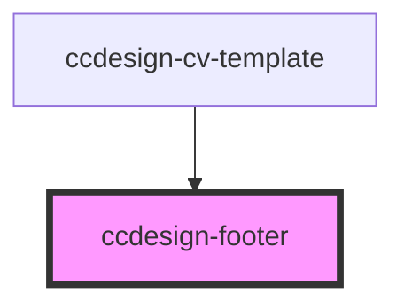

# ccdesign-footer

<!-- Auto Generated Below -->

## Properties

| Property      | Attribute | Description | Type         | Default     |
| ------------- | --------- | ----------- | ------------ | ----------- |
| `data`        | `data`    |             | `string`     | `undefined` |
| `dataContent` | --        |             | `FooterItem` | `undefined` |

## Dependencies

### Used by

 - [ccdesign-cv-template](../../template/ccdesign-cv-template)

### Graph

----------------------------------------------

*Built with [StencilJS](https://stenciljs.com/)*
