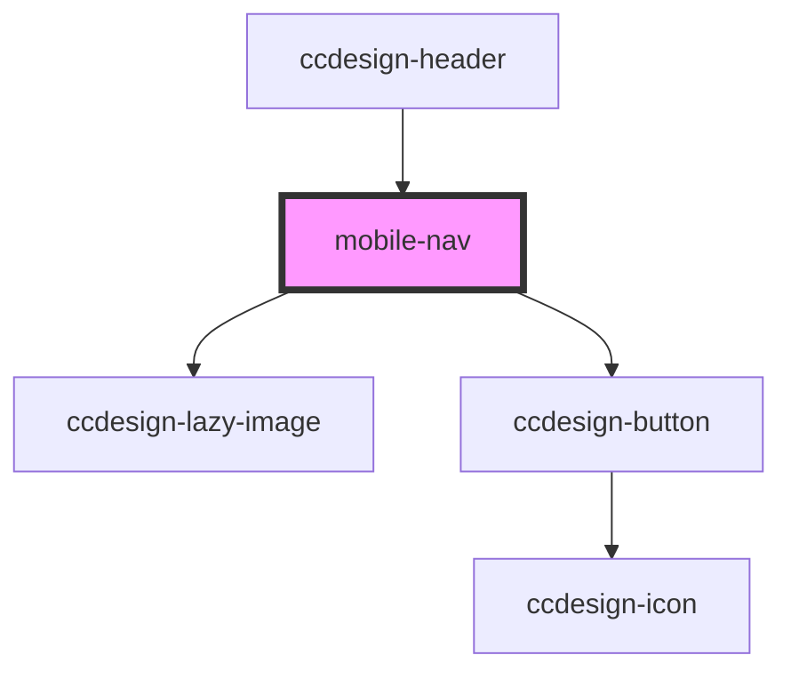

# mobile-nav

<!-- Auto Generated Below -->

## Properties

| Property | Attribute | Description | Type            | Default     |
| -------- | --------- | ----------- | --------------- | ----------- |
| `data`   | --        |             | `NavDataItem[]` | `undefined` |

## Dependencies

### Used by

 - [ccdesign-header](..)

### Depends on

- [ccdesign-lazy-image](../../../ui/ccdesign-lazy-image)
- [ccdesign-button](../../../ui/ccdesign-button)

### Graph

----------------------------------------------

*Built with [StencilJS](https://stenciljs.com/)*
