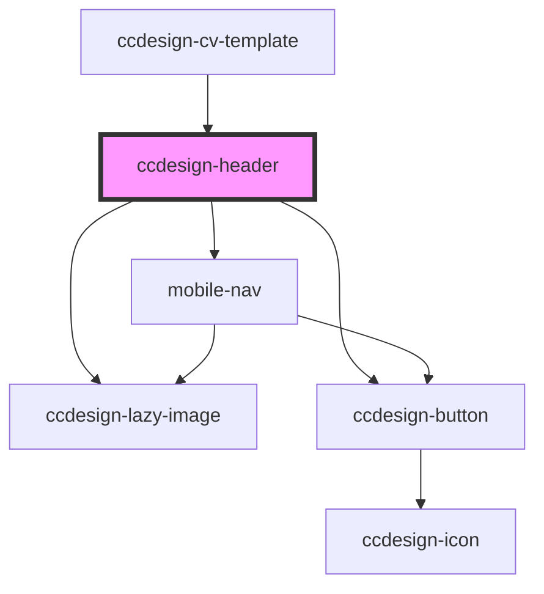

# ccdesign-header

<!-- Auto Generated Below -->

## Properties

| Property        | Attribute        | Description | Type     | Default     |
| --------------- | ---------------- | ----------- | -------- | ----------- |
| `data`          | `data`           |             | `string` | `undefined` |
| `formattedData` | `formatted-data` |             | `any`    | `undefined` |

## Dependencies

### Used by

 - [ccdesign-cv-template](../../template/ccdesign-cv-template)

### Depends on

- [ccdesign-lazy-image](../../ui/ccdesign-lazy-image)
- [ccdesign-button](../../ui/ccdesign-button)
- [mobile-nav](mobile-nav)

### Graph

----------------------------------------------

*Built with [StencilJS](https://stenciljs.com/)*
