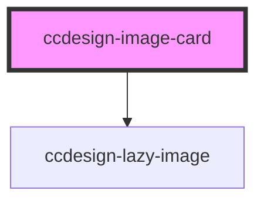

# ccdesign-image-card

<!-- Auto Generated Below -->

## Properties

| Property      | Attribute     | Description | Type     | Default     |
| ------------- | ------------- | ----------- | -------- | ----------- |
| `description` | `description` |             | `string` | `undefined` |
| `imageAlt`    | `image-alt`   |             | `string` | `undefined` |
| `imageUrl`    | `image-url`   |             | `string` | `undefined` |
| `url`         | `url`         |             | `string` | `undefined` |

## Dependencies

### Depends on

- [ccdesign-lazy-image](../../ui/ccdesign-lazy-image)

### Graph

----------------------------------------------

*Built with [StencilJS](https://stenciljs.com/)*
