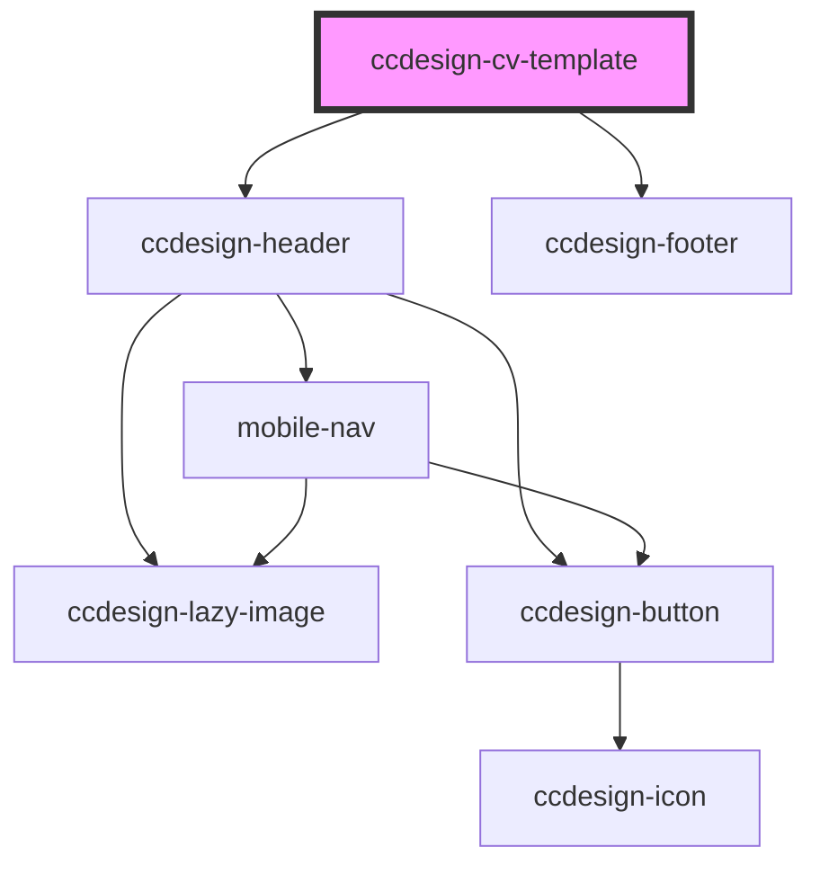

# ccdesign-cv-template

<!-- Auto Generated Below -->

## Properties

| Property | Attribute | Description | Type     | Default     |
| -------- | --------- | ----------- | -------- | ----------- |
| `footer` | `footer`  |             | `string` | `undefined` |
| `header` | `header`  |             | `string` | `undefined` |

## Dependencies

### Depends on

- [ccdesign-header](../../content/ccdesign-header)
- [ccdesign-footer](../../content/ccdesign-footer)

### Graph

----------------------------------------------

*Built with [StencilJS](https://stenciljs.com/)*
