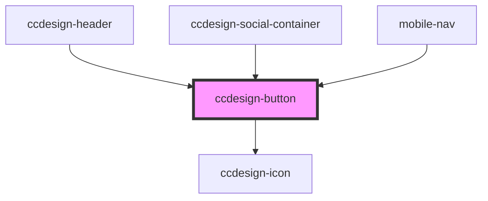

# ccdesign-button

<!-- Auto Generated Below -->

## Properties

| Property    | Attribute    | Description | Type     | Default     |
| ----------- | ------------ | ----------- | -------- | ----------- |
| `alt`       | `alt`        |             | `string` | `undefined` |
| `color`     | `color`      |             | `string` | `undefined` |
| `eventName` | `event-name` |             | `string` | `undefined` |
| `icon`      | `icon`       |             | `string` | `undefined` |
| `text`      | `text`       |             | `string` | `undefined` |
| `type`      | `type`       |             | `string` | `undefined` |
| `url`       | `url`        |             | `string` | `undefined` |

## Dependencies

### Used by

 - [ccdesign-header](../../content/ccdesign-header)
 - [ccdesign-social-container](../../content/ccdesign-social-container)
 - [mobile-nav](../../content/ccdesign-header/mobile-nav)

### Depends on

- [ccdesign-icon](../ccdesign-icon)

### Graph

----------------------------------------------

*Built with [StencilJS](https://stenciljs.com/)*
