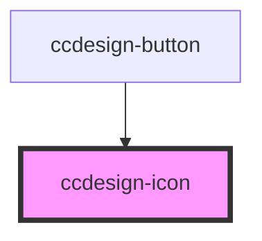

# ccdesign-icon

<!-- Auto Generated Below -->

## Properties

| Property | Attribute | Description | Type     | Default                                                            |
| -------- | --------- | ----------- | -------- | ------------------------------------------------------------------ |
| `color`  | `color`   |             | `string` | `'white'`                                                          |
| `name`   | `name`    |             | `string` | `undefined`                                                        |
| `size`   | `size`    |             | `string` | `'xs'`                                                             |
| `url`    | `url`     |             | `string` | ``https://ccdesigns.blob.core.windows.net/icons/${this.name}.svg`` |

## Dependencies

### Used by

 - [ccdesign-button](../ccdesign-button)

### Graph

----------------------------------------------

*Built with [StencilJS](https://stenciljs.com/)*
