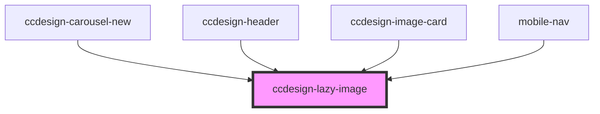

# ccdesign-lazy-image

<!-- Auto Generated Below -->

## Properties

| Property     | Attribute     | Description | Type     | Default     |
| ------------ | ------------- | ----------- | -------- | ----------- |
| `alt`        | `alt`         |             | `string` | `undefined` |
| `classNames` | `class-names` |             | `string` | `undefined` |
| `imgSrc`     | `img-src`     |             | `string` | `undefined` |

## Dependencies

### Used by

 - [ccdesign-carousel-new](../../content/ccdesign-carousel-new)
 - [ccdesign-header](../../content/ccdesign-header)
 - [ccdesign-image-card](../../content/ccdesign-image-card)
 - [mobile-nav](../../content/ccdesign-header/mobile-nav)

### Graph

----------------------------------------------

*Built with [StencilJS](https://stenciljs.com/)*
